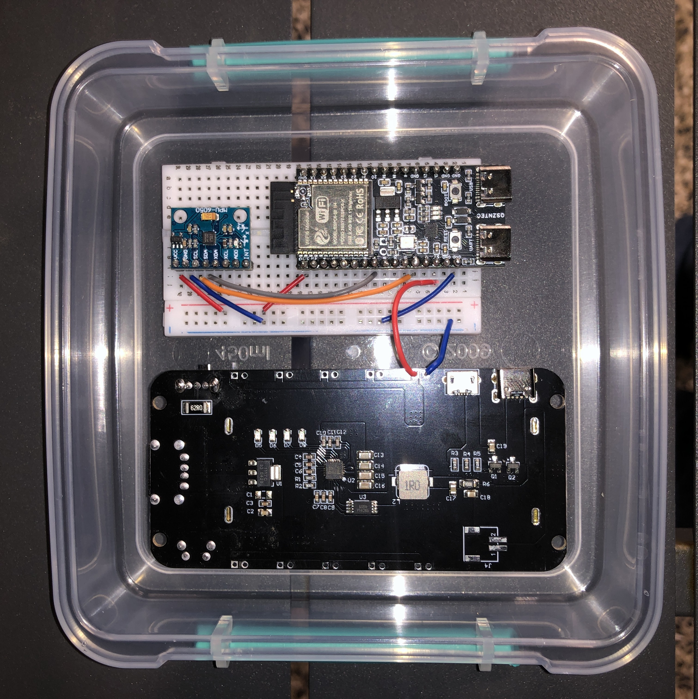
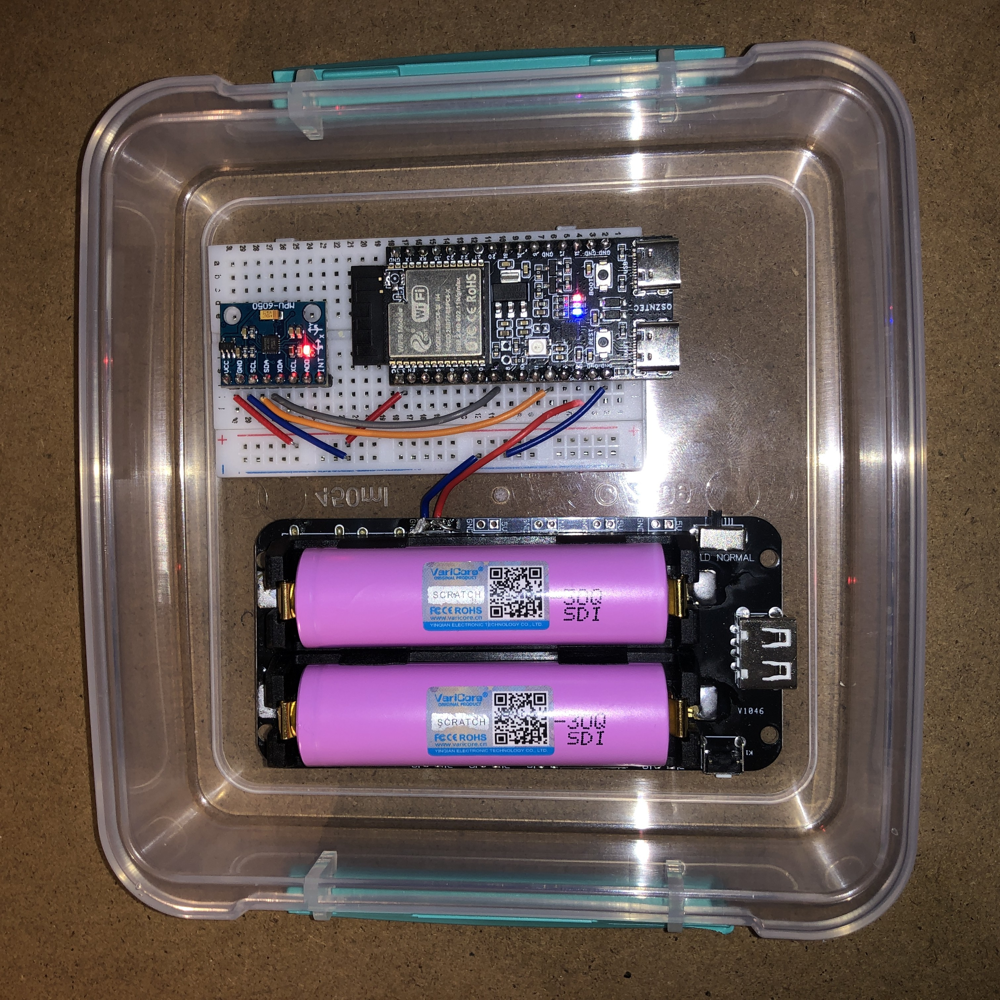
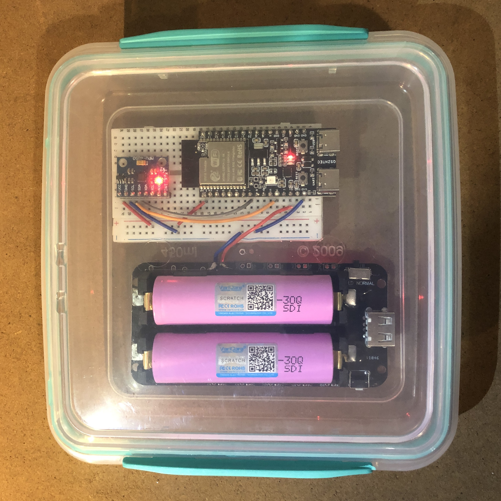
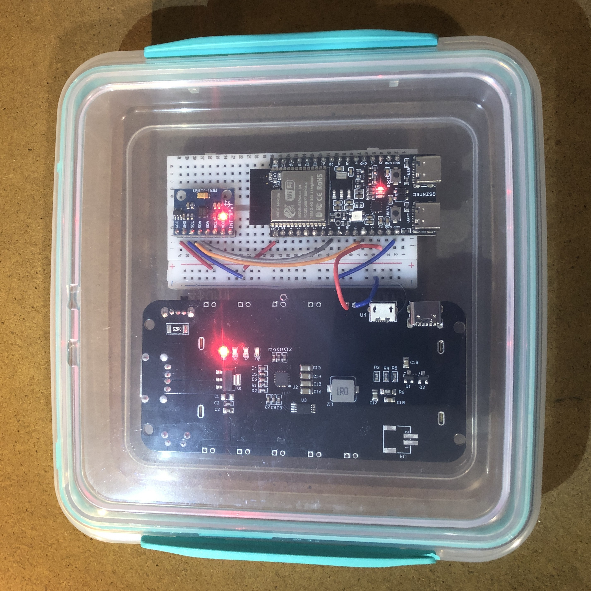

# Corto-Densimeter

**DIY densimeter for Corto Brewery use cases.**

---

## Project Context

The **Corto Densimeter** project was developed to address the need for a **DIY density sensor solution**. This sensor aims to calculate the **alcohol content** in beer by measuring how deeply the sensor is submerged, and send the data via API. The submersion depth is determined using a **gyroscope**. The device is connected to internet via WiFi.

The project reached the following milestones:
- **Alcohol content calculation** is functional but **not tested in real-world conditions**. Further testing and calibration are required.
- **Hardware wiring** is fully operational and **battery-powered**.

**Note:** The project was **abandoned** at the end of thedevelopment process due to **safety concerns**, particularly the **fire risk** associated with lithium batteries.  The code is left as-is at the end of development and has not been cleaned up. Use with caution.

---

## Project Photos
 |  |  |
 |-----------------------|-----------------------|
 |  |  |

---

### Example CLI Output

```plaintext
I (5595) MAIN: Raw Gyro: X=869, Y=6167, Z=-3011
I (5595) MAIN: Gyro (°/s): X=6.63, Y=47.08, Z=-22.98
I (6605) MAIN: Profondeur d'immersion: 8.34 mm
I (6605) MAIN: Densité estimée: 1.017 kg/m³
I (6605) MAIN: Degré d'alcool estimé: 4.36 %
I (6605) MAIN: Raw Gyro: X=-141, Y=222, Z=142
I (6605) MAIN: Gyro (°/s): X=-1.08, Y=1.69, Z=1.08
I (7615) MAIN: Profondeur d'immersion: 8.70 mm
I (7615) MAIN: Densité estimée: 1.013 kg/m³
I (7615) MAIN: Degré d'alcool estimé: 4.85 %
I (7615) MAIN: Raw Gyro: X=-457, Y=248, Z=181
I (7615) MAIN: Gyro (°/s): X=-3.49, Y=1.89, Z=1.38
I (8625) MAIN: Profondeur d'immersion: 8.76 mm
I (8625) MAIN: Densité estimée: 1.012 kg/m³
I (8625) MAIN: Degré d'alcool estimé: 4.93 %
```

---

# ===[ Espressif IDF - ESP32-C6 ]===

---

## **Prerequisites**
- **Operating System**: Ubuntu 24
- **ESP-IDF Version**: v6.1.
- **Python**: Python 3.6 or later.
- **Hardware**: ESP32-C6-DevKitC-1 board.

---

## **Setup Instructions**

### **1. Install Dependencies**
Update your Linux system and install the necessary tools:

```bash
sudo apt update
sudo apt install git wget flex bison gperf python3 python3-pip python3-venv cmake ninja-build ccache libffi-dev libssl-dev dfu-util libusb-1.0-0
```

---

### **2. Install ESP-IDF**
Clone the ESP-IDF repository and install the tools:

```bash
mkdir -p ~/esp
cd ~/esp
git clone --recursive https://github.com/espressif/esp-idf.git
cd esp-idf
git checkout v6.1
./install.sh
```

---

### **3. Configure Permissions (udev rules)**
Allow your system to communicate with the ESP32-C6:

```bash
sudo cp --update=none ~/.espressif/tools/openocd-esp32/v0.12.0-esp32-20250707/openocd-esp32/share/openocd/contrib/60-openocd.rules /etc/udev/rules.d/
sudo udevadm control --reload-rules
sudo udevadm trigger
```

---

### **4. Configure ESP-IDF Environment**
Activate the ESP-IDF environment in your terminal:

```bash
. ~/esp/esp-idf/export.sh
```

To avoid repeating this command every time you open a terminal:

```bash
echo ". ~/esp/esp-idf/export.sh" >> ~/.bashrc
source ~/.bashrc
```

---

### **5. Verify Installation**
Check if everything is correctly installed:

```bash
idf.py --version
```

---

## **Project Commands**

### **1. Navigate to the Project Directory**
Ensure you are in the correct project directory:

```bash
cd ~/Documents/Corto-Densimeter/Espressif
```
---

### **2. Clean the Project**
To remove the `build` directory and clean properly:

```bash
rm -rf build/
idf.py fullclean
```

---

### **3. Set the Target**
Set the target to ESP32-C6:

```bash
idf.py set-target esp32c6
```

---

### **4. Configure Drivers (if needed)**
To enable I2C and GPIO drivers:

```bash
idf.py menuconfig
```
- Navigate to **Component config** → **Driver Config**.
- Enable **Enable I2C master driver** and **Enable GPIO driver**.
- Save and exit (`S` then `Q`).

---

### **5. Build the Project**
To compile the project:

```bash
idf.py build
```

---

### **6. Flash and Monitor**
To flash the project to the board and monitor the serial output:

```bash
idf.py -p /dev/ttyACM0 flash monitor
```

---

## **Complete and Safe Procedure**

Here is a complete procedure to clean, configure, and compile your project without errors:

```bash
cd ~/Documents/Corto-Densimeter/Espressif
rm -rf build/ sdkconfig
idf.py set-target esp32c6
idf.py build
idf.py -p /dev/ttyACM0 flash monitor
```

---

## **Troubleshooting**

### **Missing Dependencies Errors**
If you encounter errors like:
```
fatal error: driver/i2c_master.h: No such file or directory
```
or
```
fatal error: driver/gpio.h: No such file or directory
```
- Ensure that the dependencies `esp_driver_i2c` and `esp_driver_gpio` are declared in the `CMakeLists.txt` file in your `main` directory:
  ```cmake
  REQUIRES driver esp_driver_i2c esp_driver_gpio
  ```

---

### **Compilation Issues**
- Make sure all dependencies are installed.
- Ensure that the `sdkconfig` file contains:
  ```ini
  CONFIG_I2C_ENABLED=y
  ```

---

## **Additional Notes**
- If you are using a Docker container or a `.devcontainer`, ensure all dependencies are installed in the containerized environment.
- For more information, refer to the [official ESP-IDF documentation](https://docs.espressif.com/projects/esp-idf/).
